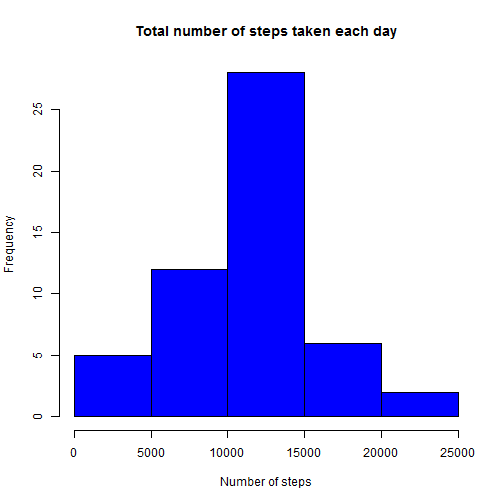

## Loading and preprocessing the data
The following code chunck unzip the activity.zip file then load the data using read.csv


```r
## Load the data
unzip("activity.zip", overwrite = TRUE)
data <- read.csv("activity.csv", stringsAsFactors = FALSE)

## Process/transform the data (if necessary) into a format suitable for your analysis
library(lubridate)
## create datetime column by adding date to minutes interval
data$datetime <- ymd(data$date) + new_difftime(minutes = data$interval)
## as.Date: converts charcters to Date using "dd/mm/yyyy" format 
data$date <- as.Date(data$date)
```


## What is mean total number of steps taken per day?

```r
## Make a histogram of the total number of steps taken each day
## compute the total number of steps per day
stepsperday <- aggregate(steps ~ date, data = data, FUN = sum)
## Make a histogram
hist(stepsperday$steps, col="blue", main = "Total number of steps taken each day", xlab = "Number of steps")
```

 


## What is the average daily activity pattern?


## Imputing missing values


## Are there differences in activity patterns between weekdays and weekends?
