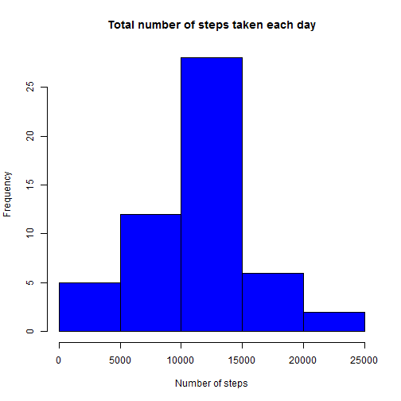

## Loading and preprocessing the data
#### 1. Load the data

```r
unzip("activity.zip", overwrite = TRUE)
data <- read.csv("activity.csv", stringsAsFactors = FALSE)
```

#### 2. Process/transform the data (if necessary) into a format suitable for your analysis

```r
## as.Date: converts charcters to Date using "yyyy-mm-dd" format 
data$date <- as.Date(data$date, format = "%Y-%m-%d")
```


## What is mean total number of steps taken per day?
#### 1. Make a histogram of the total number of steps taken each day

```r
## compute the total number of steps per day ignoring the missing values
stepsperday <- aggregate(steps ~ date, data = data, FUN = sum)
## Make a histogram
hist(stepsperday$steps, col="blue", main = "Total number of steps taken each day", xlab = "Number of steps")
```

 

#### 2. Calculate and report the mean and median total number of steps taken per day

the mean of total number of steps taken per day is 1.0766189 &times; 10<sup>4</sup>

the median of total number of steps taken per day is 10765


## What is the average daily activity pattern?
#### 1. Make a time series plot (i.e. type = "l") of the 5-minute interval (x-axis) and the average number of steps taken, averaged across all days (y-axis)

```r
## compute the average number of steps taken across all days ignoring the missing values
asteps <- aggregate(steps ~ interval, data = data, FUN = "mean")
## create time column by adding coverting interval to H:m
asteps$time <- paste(asteps$interval%/%100, asteps$interval%%100, sep = ":")
## as.POSIXlt: converts charcters to Time using "H:M" format
asteps$time <- as.POSIXlt(asteps$time, format = "%H:%M")
plot(x = asteps$time, y = asteps$steps, type ="l", xlab = "Time", ylab = "Average number of steps", col = "blue")
```

 

#### 2. Which 5-minute interval, on average across all the days in the dataset, contains the maximum number of steps?

```r
## order average steps across all the days 'asteps' by steps, extract the row of the maximum number of steps (first line)
maxstepsrow <- with(asteps, order(-steps))[1]
## extract the value of interval column for the maxstepsrow 
maxinterval <- asteps[maxstepsrow, "interval"]
```

The 5-minute interval that contain the maximum number of steps , on average across all the days in the dataset, is 835 


## Imputing missing values
#### 1. Calculate and report the total number of missing values in the dataset (i.e. the total number of rows with NAs)

```r
## the sum of na values returns the total number of missing values in the dataset for each column
## the first column steps contains all the missing values
missingvalues <- sapply(data, function(x) sum(is.na(x)))

nbna <- missingvalues[1]
```
the total number of missing values in the dataset is 2304

#### 2. Devise a strategy for filling in all of the missing values in the dataset. The strategy does not need to be sophisticated. For example, you could use the mean/median for that day, or the mean for that 5-minute interval, etc.

```r
## use the mean for that 5-minute interval ignoring the missing values
avsteps <- aggregate(steps ~ interval, data = data, FUN = "mean")
## Merge the aggregate data into the original data as a new imputation column based on interval link
data1 <- merge(x = data, y = avsteps, "interval")
## rename columns
colnames(data1) <- c("interval", "steps", "date", "avsteps")
```
#### 3. Create a new dataset that is equal to the original dataset but with the missing data filled in.

```r
## replace missing values by average value
data1$steps[is.na(data1$steps)] <- data1$avsteps[is.na(data1$steps)]
## keep usefull columns
data1 <- data1[, c("interval", "steps", "date")]
```

#### 4. Make a histogram of the total number of steps taken each day and Calculate and report the mean and median total number of steps taken per day.

```r
## compute the total number of steps per day ignoring the missing values
stepsperday1 <- aggregate(steps ~ date, data = data1, FUN = sum)
## Make a histogram
hist(stepsperday1$steps, col="blue", main = "Total number of steps taken each day", xlab = "Number of steps")
```

 


## Are there differences in activity patterns between weekdays and weekends?
